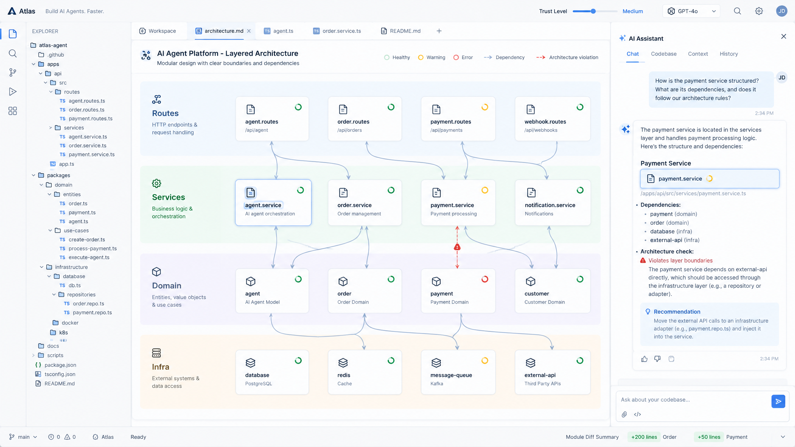
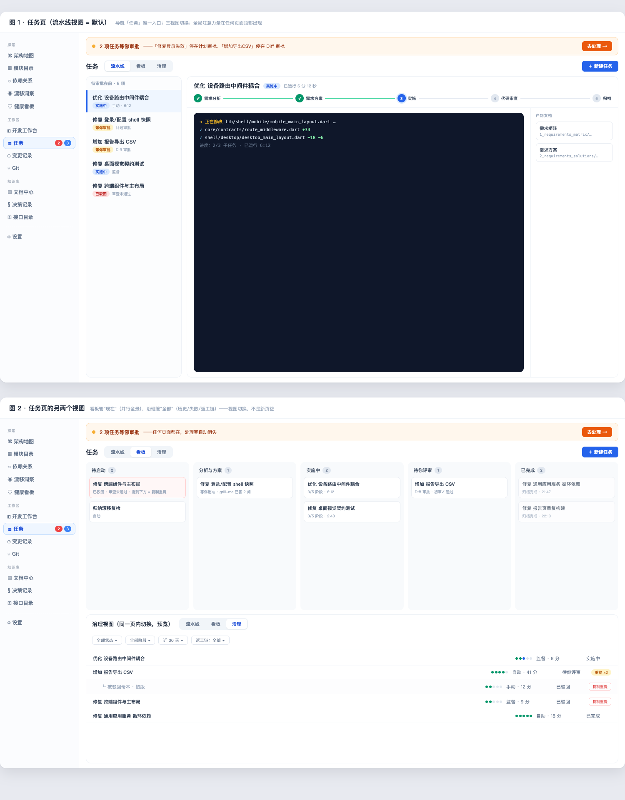
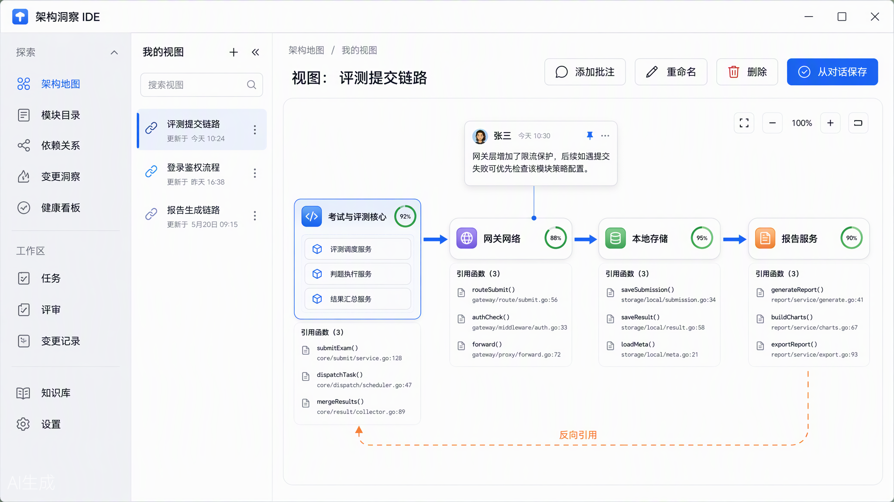
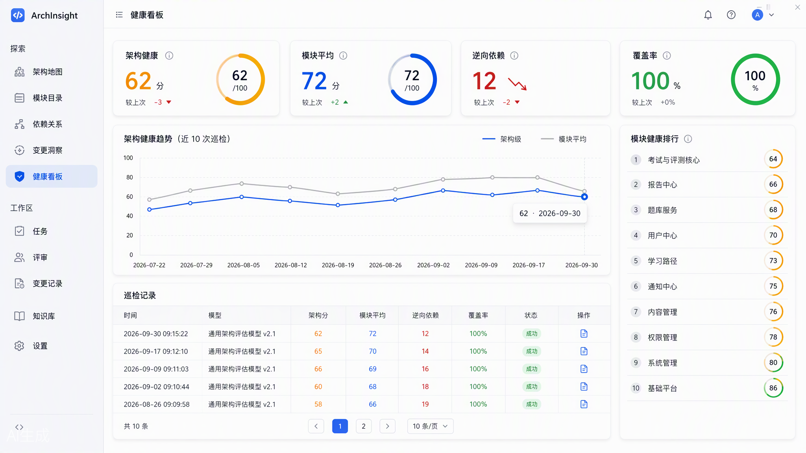
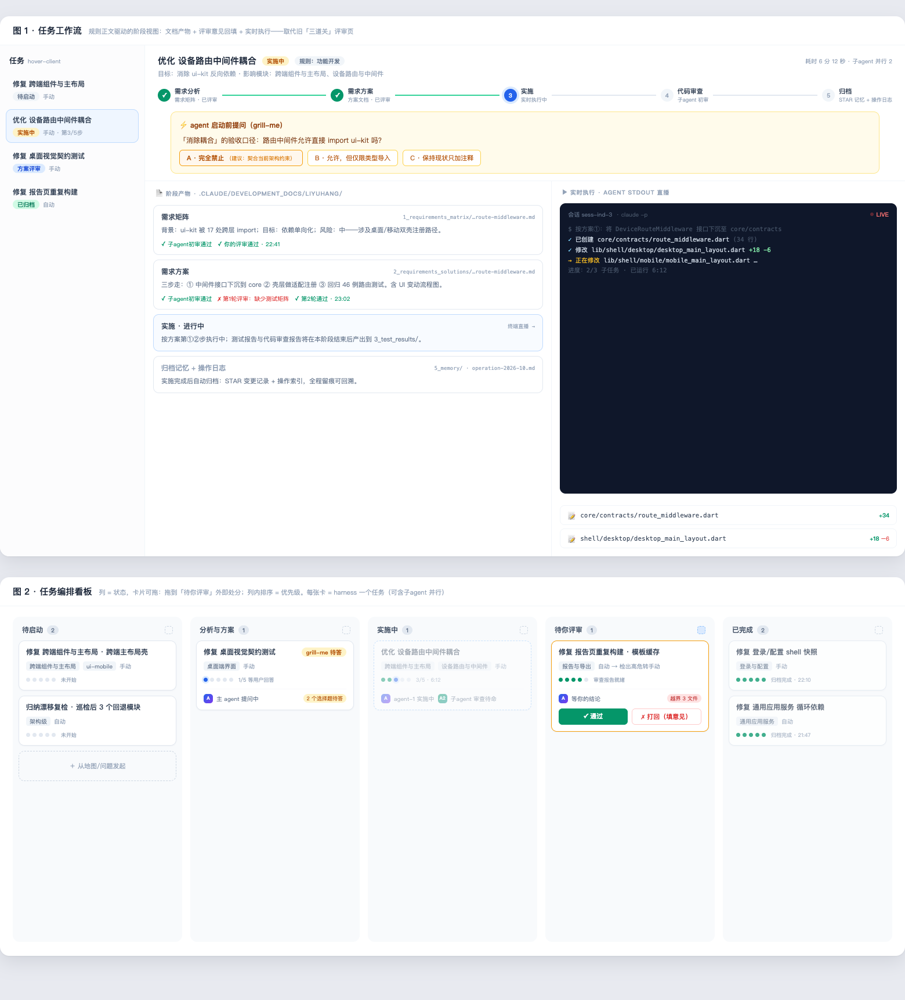
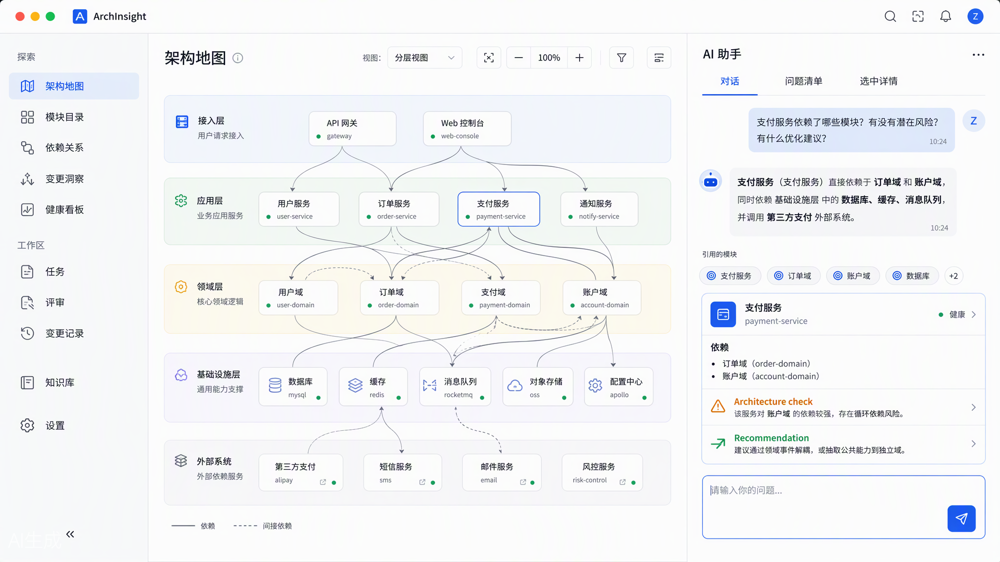
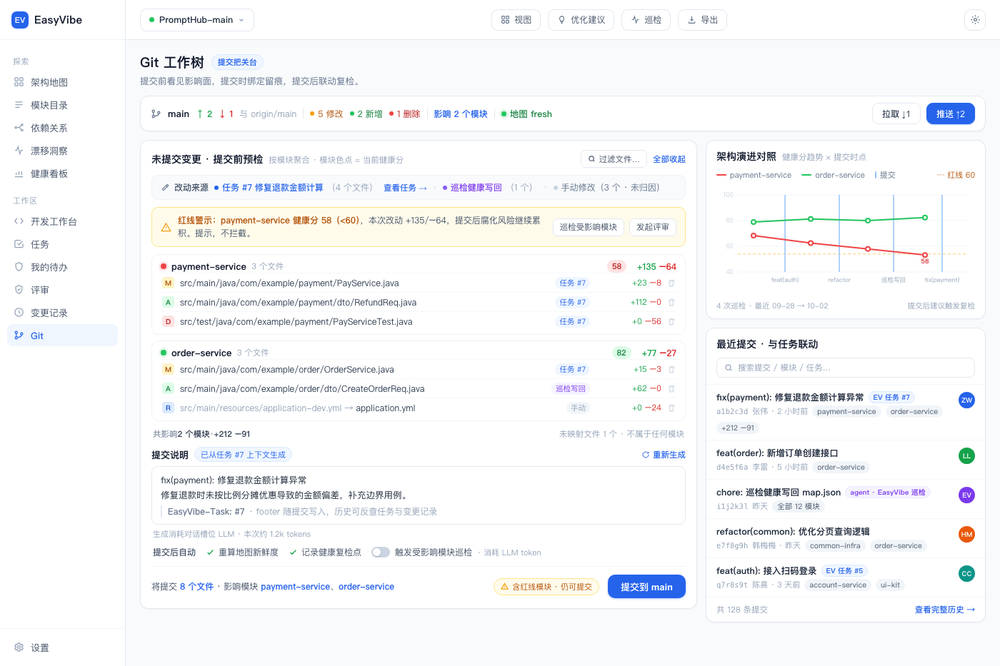

<p align="center">
  
</p>

<p align="center">
  
  &nbsp;
  
  &nbsp;
  
</p>

---

<p align="center">
  <strong>The VibeCoding IDE with built-in architecture governance</strong><br>
  <em>Semantic Code Map | Health Audit | Harness-governed Agent Workflows | Multi-Agent | Multi-Repo | Local-first</em>
</p>

<p align="center">
  <em>Humans own structure and boundaries; agents own implementation and details.<br>人管结构与边界，Agent 管实现与细节。</em>
</p>

<p align="center">
  <a href="https://github.com/JCPSer/EasyVibe/releases">
    
  </a>
</p>

<p align="center">
  <strong>English</strong> | <a href="./README.zh-CN.md">简体中文</a>
</p>

---

## 📋 Quick Navigation

<p align="center">
<a href="#-beyond-the-file-tree">Why EasyVibe</a> ·
<a href="#-semantic-code-map">Code Map</a> ·
<a href="#-architecture-health-audit">Health Audit</a> ·
<a href="#-harness-governed-agent-workflows">Harness Workflows</a> ·
<a href="#-quick-start">Quick Start</a>
</p>

---

## 🧭 Beyond the File Tree

**EasyVibe is more than an agent chat client.** In the vibe-coding era, a wall sits between you and your codebase: the agent writes the code, and you no longer know what the repo looks like, where module boundaries are, or how severe coupling has become. EasyVibe gives you an **architecture view** — modules, responsibilities, dependencies, blast radius — and puts a governance harness around every agent task.

| | Traditional IDEs / AI Chat Clients | **EasyVibe** |
| :-- | :-- | :-- |
| See what the repo *actually* looks like | File tree & text | **Living architecture map, generated from the real code** |
| Know if the architecture is healthy | No | **Module-level + architecture-level LLM audit with drift tracking** |
| Control how agents change the code | Hope for the best | **Requirements matrix → solution design → review gates, all traceable** |
| Multi-agent support | Single chat | **Claude Code / Codex / OpenCode + any Anthropic/OpenAI-compatible endpoint** |
| Multi-repo workspaces | — | **First-class — register & switch repos in-app** |
| Setup | — | **Zero config — single binary, double-click, UI embedded** |

<p align="center">
  
</p>

---

## 🗺️ Semantic Code Map

An LLM-generated architecture map, stored **inside the repo** (`.easyvibe/map/`) — git-visible, agent-writable, re-inducible. Layer count, names and responsibilities are all derived from the actual project, never hardcoded.

- **Dynamic layered canvas** — modules grouped into semantic layers, health rings, reverse-dependency edges highlighted
- **Drill-down** — expand any module into a lazy-loaded depth-1 submap of its internal wiring
- **Custom views** — turn any conversation answer into a persistent, reusable view (entity references + annotations, never layouts)
- **Live updates** — file watching streams map growth to the UI in real time; re-induction is one click

<p align="center">
  
</p>

---

## 🩺 Architecture Health Audit

Every module healthy ≠ the architecture is healthy. EasyVibe assesses health at **two levels**: per-module and whole-architecture.

- **LLM evaluation** with coupling / complexity / churn / decay flags and prioritized concerns
- **Baseline-aware patrol** — each run injects the previous health snapshot as context, so drift is measured, not guessed
- **Freshness tracking** — git change detection ranks how stale each module has become since its last audit

<p align="center">
  
</p>

---

## 🛡️ Harness-governed Agent Workflows

Every development task — feature or bugfix — flows through the harness: **requirements matrix → solution design → implementation → code review**, with structured gates in between.

- **Kanban + pipeline views** over the full workflow; jump from any card to its live pipeline
- **Manual or auto approval** — manual mode gives you three gates (plan → diff → review report); auto mode skips approval but keeps the full audit trail
- **In-repo traceability** — every artifact is archived into the repo (`.easyvibe/development_docs/`), reviewable long after the task closes
- **Remediation loop** — failed reviews send tasks back with structured feedback, not dead ends

<p align="center">
  
</p>

---

## 🤖 Agents & Providers

- **Presets for Claude Code, Codex and OpenCode**, or bring any Anthropic / OpenAI-compatible endpoint
- **Per-slot LLM binding** — cheap fast models for map patrol, strong models for architecture analysis
- **Streaming chat** — real-time terminal with `stream-json` output, interrupt, markdown & mermaid rendering, image attachments
- **Auto-detection & connection testing** — the app finds installed agents and verifies connectivity before you spend a token

For Codex, install the CLI, run `codex login`, then select and save the **Codex CLI** preset in settings.
The default is `codex exec --json --sandbox workspace-write`, with live messages, command/file-change summaries, and task-result capture.
Connection probes use a read-only sandbox and allow a temporary non-repository directory. Reported token usage is persisted; unreported cost and model remain unknown.
Reselect the preset to upgrade an existing plain-text configuration. Codex remains experimental; validate against a test repository first. See [integration validation](./tests/codex-integration.md).

<p align="center">
  
</p>

---

## 🌲 Git & Multi-Repo

Worktree support, change tracking and history — plus first-class multi-repo workspaces: register local repositories, switch between them, and get per-repo maps and health baselines.

<p align="center">
  
</p>

---

## 🚀 Quick Start

### Desktop app

```bash
./scripts/dev.sh /path/to/your/repo
```

Starts the backend (7101) + renderer (7100) and opens your repo's architecture map.

### Standalone binary — zero config

Grab the single-file backend from [Releases](https://github.com/JCPSer/EasyVibe/releases) and double-click it. Prompts, schema and UI are all embedded — it opens in your browser, nothing else needed.

### From source

```bash
# Backend (Rust)
cd easyvibe-backend && cargo build

# Frontend (React + Vite)
cd easyvibe-renderer && npm install && npm run dev
```

Cross-compile the Windows backend from macOS (statically linked, zero DLL dependencies):

```bash
export PATH=<llvm-mingw>/bin:$PATH
RUSTFLAGS="-C target-feature=+crt-static" \
  cargo build --release --target x86_64-pc-windows-gnullvm -p easyvibe-app
```

---

## 🏗️ Architecture

```
easyvibe-backend   Rust workspace — axum REST + WS, agent sessions, LLM slots,
                   SQLite state, map watchers (7 crates)
easyvibe-renderer  React 18 + Vite + React Flow + Tailwind — the map UI
easyvibe-desktop   Tauri v2 shell — macOS & Windows (Windows installer via CI)
```

**Two-domain storage:** repo-derived data (map, submaps, views, development docs) lives as JSON files inside the repo — git-visible and agent-writable. IDE-owned state (conversations, task/approval records, health history) lives in SQLite. The map never moves into a database.

---

## 📌 Status & Roadmap

**Pre-alpha, in active development.** Interfaces, data formats and UX are evolving; macOS and Windows are the primary targets.

Planned: self-hosted agent engine, team mode, plugin-extensible harness, exports, Linux support.

## 📄 License

[Apache-2.0](./LICENSE)
