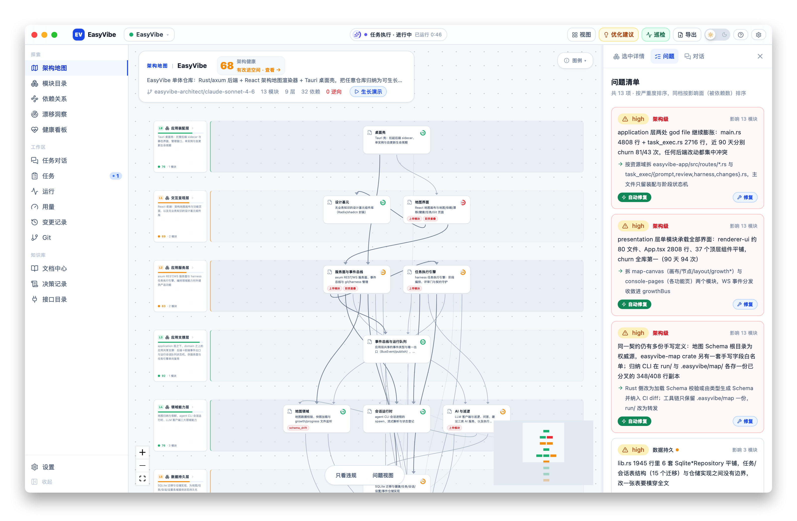

<p align="center">
  
</p>

<p align="center">
  
  &nbsp;
  
  &nbsp;
  
</p>

---

<p align="center">
  <strong>自带架构治理的 VibeCoding IDE</strong><br>
  <em>语义代码地图 | 架构健康审计 | Harness 护栏工作流 | 多 Agent | 多仓库 | 本地优先</em>
</p>

<p align="center">
  <em>人管结构与边界，Agent 管实现与细节。</em>
</p>

<p align="center">
  <a href="https://github.com/JCPSer/EasyVibe/releases">
    
  </a>
</p>

<p align="center">
  <a href="./README.md">English</a> | <strong>简体中文</strong>
</p>

---

## 📋 快速导航

<p align="center">
<a href="#-为什么是-easyvibe">为什么是 EasyVibe</a> ·
<a href="#-语义代码地图">代码地图</a> ·
<a href="#-架构健康审计">健康审计</a> ·
<a href="#-harness-护栏工作流">Harness 工作流</a> ·
<a href="#-快速开始">快速开始</a>
</p>

---

## 🧭 为什么是 EasyVibe

**EasyVibe 不只是一个 Agent 对话客户端。** Vibe coding 时代，人与代码之间隔着 Agent：代码是"长出来"的，你不知道仓库现在长什么样、模块边界在哪、耦合多严重。EasyVibe 给你**架构视角**——模块、职责、依赖、变更影响面——并让每个 Agent 任务都在治理护栏内执行。

| | 传统 IDE / AI 对话客户端 | **EasyVibe** |
| :-- | :-- | :-- |
| 看清仓库的真实结构 | 文件树与文本 | **由真实代码生成的活的架构地图** |
| 架构是否健康 | 无从得知 | **模块级 + 架构级 LLM 审计，漂移可追踪** |
| Agent 改代码如何管控 | 凭运气 | **需求矩阵 → 方案设计 → 审查门禁，全程留痕** |
| 多 Agent 支持 | 单对话 | **Claude Code / Codex / OpenCode + 任意兼容端点** |
| 多仓库工作区 | — | **一等公民——应用内注册与切换** |
| 上手成本 | — | **零配置——单文件双击即用，UI 内嵌** |

<p align="center">
  
</p>

---

## 🗺️ 语义代码地图

LLM 归纳的架构地图，存储在**仓库内**（`.easyvibe/map/`）——git 可见、agent 可写、可重新归纳。层数、层名、层职责全部由项目实际结构推导，不硬编码。

- **动态分层画布**——模块按语义分层，健康环、逆向依赖红虚线
- **模块展开**——懒加载深度 1 层子图，看模块内部连线
- **自定义视图**——对话回答一键存为可复用视图（只存实体引用+批注，不存布局）
- **实时生长**——文件监听把地图生长直播到 UI；重新归纳一键触发

<p align="center">
  
</p>

---

## 🩺 架构健康审计

每个模块都健康 ≠ 架构健康。EasyVibe 做**两级评估**：模块级 + 架构级。

- **LLM 评估**——耦合/复杂度/变更频次/腐化标记，问题按严重度排序
- **基线巡检**——每次巡检注入上轮健康快照作为上下文，漂移是量出来的不是猜的
- **新鲜度追踪**——结合 git 变更计算各模块自上次审计以来的落后程度并排序

<p align="center">
  
</p>

---

## 🛡️ Harness 护栏工作流

每个开发任务（功能/修复）都走完整 harness 流程：**需求矩阵 → 方案设计 → 代码开发 → 代码审查**，中间是结构化门禁。

- **看板 + 流水线双视图**——全流程一目了然，卡片直达对应流水线
- **手动/自动两档审批**——手动档三道关（计划→Diff→审查报告）；自动档跳过审批但留痕不减
- **仓库内留痕**——全部产物归档进仓库（`.easyvibe/development_docs/`），任务关闭后仍可审查
- **修复闭环**——审查不通过带结构化反馈打回，不是死胡同

<p align="center">
  
</p>

---

## 🤖 Agent 接入

- **Claude Code / Codex / OpenCode 预设**，或接入任意 Anthropic / OpenAI 兼容端点
- **槽位独立绑模型**——巡检用便宜快模型，架构分析用强模型
- **流式对话**——stream-json 真实时终端、可打断、Markdown/Mermaid 渲染、图片附件
- **自动探测与测试连接**——自动发现已装 agent，先测连通再烧钱

<p align="center">
  
</p>

---

## 🌲 Git 与多仓库

工作树支持、变更追踪与历史记录；多仓库工作区是一等公民：注册本地仓库、随切随换，每个仓库有自己的地图与健康基线。

<p align="center">
  
</p>

---

## 🚀 快速开始

### 桌面应用

```bash
./scripts/dev.sh /path/to/your/repo
```

启动后端（7101）+ 渲染器（7100），打开你仓库的架构地图。

### 独立二进制——零配置

从 [Releases](https://github.com/JCPSer/EasyVibe/releases) 下载单文件后端，双击即用。提示词、schema、前端全部内嵌，自动打开浏览器，无需任何配置。

### 源码构建

```bash
# 后端（Rust）
cd easyvibe-backend && cargo build

# 前端（React + Vite）
cd easyvibe-renderer && npm install && npm run dev
```

macOS 交叉编译 Windows 后端（静态链接、零 DLL 依赖）：

```bash
export PATH=<llvm-mingw>/bin:$PATH
RUSTFLAGS="-C target-feature=+crt-static" \
  cargo build --release --target x86_64-pc-windows-gnullvm -p easyvibe-app
```

---

## 🏗️ 技术架构

```
easyvibe-backend   Rust workspace——axum REST + WS、agent 会话、LLM 槽位、
                   SQLite 状态库、地图监听（7 个 crate）
easyvibe-renderer  React 18 + Vite + React Flow + Tailwind——地图 UI
easyvibe-desktop   Tauri v2 桌面壳——macOS 与 Windows（Windows 安装包走 CI）
```

**两域分离存储**：仓库派生数据（地图/子图/视图/开发留痕）是仓库内 JSON 文件——git 可见、agent 可写；IDE 自有状态（对话历史、任务/审批留痕、健康分历史）存 SQLite。地图永不入库型数据库。

---

## 📌 状态与路线图

**Pre-alpha，活跃开发中。** 接口、数据格式、交互都在快速演进，macOS 与 Windows 是主要目标平台。

规划：自研 agent 引擎、团队模式、插件化 harness、导出功能、Linux 支持。

## 📄 许可证

[Apache-2.0](./LICENSE)
